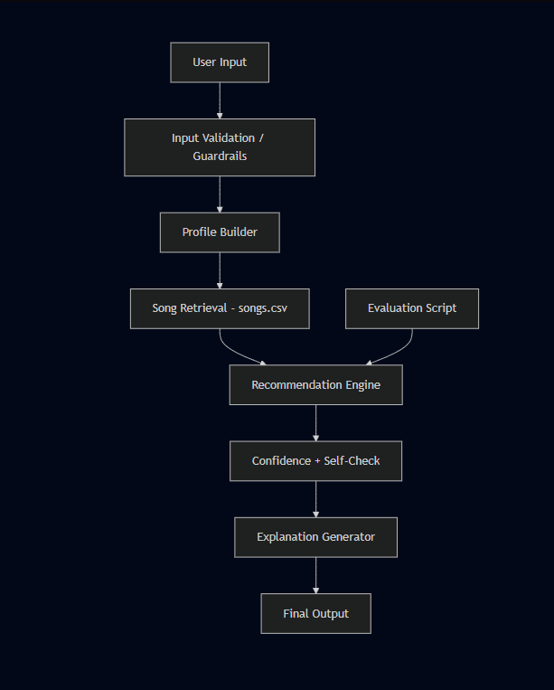
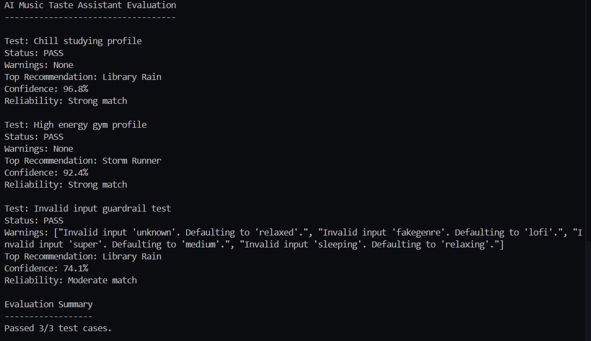

# 🎧 AI Music Taste Assistant: An Explainable Recommendation System

## Original Project

This project is an extension of my Module 3 project: **Music Recommender Simulation**.  
The original system used a content-based approach to recommend songs by comparing user preferences to song features such as genre, mood, energy, valence, and tempo. It generated recommendations by scoring and ranking songs, but it did not include explanations, user interaction, or reliability checks.

---

## Project Summary

The AI Music Taste Assistant recommends songs based on a user’s mood, genre, energy level, and activity. It uses similarity scoring to rank songs and provides explanations for each recommendation. The system also includes input validation, confidence scoring, and guardrails to ensure reliable outputs.

---

## Why It Matters

Users often spend time searching for music that matches their mood or activity. This system automates that process and improves user experience by providing personalized and explainable recommendations.

---

## Architecture Overview

The system follows a modular pipeline:

User Input → Input Validation → Profile Builder → Song Retrieval → Recommendation Engine → Confidence Check → Explanation Generator → Output

- **Input Validation** ensures invalid inputs are handled safely.
- **Profile Builder** converts user preferences into a structured format.
- **Recommendation Engine** scores and ranks songs based on similarity.
- **Confidence Check** evaluates how strong each recommendation is.
- **Explanation Generator** provides transparency into AI decisions.
- **Testing Script** evaluates system reliability across multiple cases.

---

## Setup Instructions

1. Clone the repository:
```bash
git clone https://github.com/YOUR-USERNAME/applied-ai-system-final.git
cd applied-ai-system-final

2.Install dependcies:
pipe install -r requirements.txt

3. Run system: 
python -m src.main

4. Run evaluation test:
python -m tests.evaluate_system

## Sample insstructions:

Example 1: Chill Studying Profile

Input:

Mood: chill
Genre: lofi
Energy: low
Activity: studying

Output:

Library Rain
Confidence: 96.8%
Reliability: Strong match
Midnight Coding
Confidence: 93.1%
Reliability: Strong match

Example 2: High Energy Gym Profile

Input:

Mood: intense
Genre: rock
Energy: high
Activity: gym

Output:

Storm Runner
Confidence: 92.4%
Reliability: Strong match

Example 3: Invalid Input (Guardrail)

Input:

Mood: unknown

Output:

Warning: Invalid input → defaults applied
System still returns valid recommendations

// Design Decisions:

I used a modular design to separate profile building, recommendation logic, and explanation generation.
I used similarity scoring because it is simple, interpretable, and effective for small datasets.
I added confidence scoring to help users understand how strong each recommendation is.
I included guardrails to handle invalid inputs and ensure system stability.

// Trade-offs
The dataset is small, so recommendations are limited.
The system does not use advanced machine learning models.
Some songs may have similar scores, making ranking less distinct.

// Testing Summary

I created an evaluation script to test the system across multiple user profiles.

// Results:

Passed 3/3 test cases
Successfully handled:
normal inputs
high-energy profiles
invalid inputs with guardrails

// What worked:

The system consistently produced relevant recommendations
Explanations improved transparency
Guardrails prevented crashes and handled edge cases

// What didn’t:

Some edge cases produced moderate matches due to limited data
Recommendations depend heavily on available song features

//## Reflection and Ethics

One limitation of my system is that it relies on a small dataset and a fixed set of features such as genre, mood, and energy. Because of this, it may not capture more complex aspects of music preference, like lyrics, artist familiarity, or changing user tastes. It can also be biased toward certain genres or moods if those are overrepresented in the dataset.

This AI could be misused if someone assumes the recommendations are always correct or fully personalized. In reality, the system only uses the inputs provided and does not learn from real user behavior. To prevent misuse, the system includes explanations and confidence scores so users understand how recommendations are generated and how reliable they are.

While testing the system, I was surprised by how important input validation was. Small mistakes in user input, like typos, could affect the results significantly. Adding guardrails improved the system’s reliability and ensured it could still function even with invalid inputs.

During this project, I collaborated with AI tools to help structure and improve my system. One helpful suggestion was adding confidence scoring and explanations, which made the system more transparent and aligned with real-world AI systems. However, one flawed suggestion was initially overcomplicating the design with unnecessary features, which I simplified to keep the system clear and focused. This experience showed me that AI can be a useful assistant, but it still requires human judgment to decide what is actually useful and appropriate.

## Reliability and Evaluation

To test reliability, I added an evaluation script that runs the recommender on multiple user profiles, including normal inputs and invalid inputs. The system checks whether recommendations are returned, whether explanations are included, and whether confidence scores are generated.

The system passed **3 out of 3 test cases**. It successfully handled a chill studying profile, a high-energy gym profile, and an invalid input case using guardrails. Confidence scores helped show whether each recommendation was a strong, moderate, or weak match.

One limitation is that the system depends on a small song dataset, so some edge cases may still produce only moderate matches instead of strong ones.





if pytest does not work and throw errors please try the below:
PYTHONPATH=. pytest